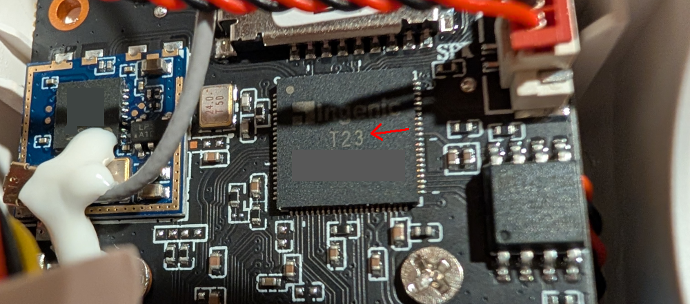

# WANSVIEW W7

This directory contains pre-made SD card images (zipped up) for first-time installation of thingino to your camera.

The images in the installers are updated around once a week, you probably want to do a full upgrade after installing!

# These SD images will upgrade your camera from factory firmware to Thingino. Don't try to use this for upgrading afterwards!

# This is for the normal W7 model, not the SOLAR or 4G LTE versions which are unsupported!

Buy it at Amazon: https://amzn.to/3yTUFob
Installation video here: https://youtu.be/jCRiIljSWlw

## Installation instructions

NOTE: These instructions are the *initial flash* from factory firmware to Thingino, and should not be confused with the instructions for [unbricking][1]!

### Identifying the processor

Wansview has updated the W7 and newer models use the T23 processor instead of the T31. The only way to tell is to look inside. Follow [this video][2] to see how to open up the camera to see the chip.

### Steps

1. Verify which processor your cam has (T31 or T23).
2. Download the appropriate zip file from above.
3. Use your favorite SD card writer (for example Raspberry Pi Imager) to write the image file to your physical SD card (you should not need to extract the zip file).
4. Insert the SD card into the camera and plug it in to start it up.
5. Wait about 3 minutes and you should see an open WiFi network name that starts with `Thingino`.
6. Proceed with [configuring wireless access][3].

Check out the [wiki page](https://github.com/themactep/thingino-firmware/wiki/Camera:-Wansview-W7-Galayou-Y4) for more info.

## SD card install instructions:

NOTE: These instructions don't use the installer files above.  Instead, you prepare the SD card yourself.

1. Format micro SD card using FAT32. exfat will not work!
2. Grab the latest Thingino firmware release from https://thingino.com for the Wansview W7 with the processor that matches yours.
3. Rename the thingino firmware to v4_all.bin and move it to the SD card
4. Cleanly remove the SD from your PC and put it in the cam
5. Power up the cam and wait a few minutes, you should see the new wifi network you can connect to and configure the camera

[1]: https://github.com/themactep/thingino-firmware/wiki/Camera:-Wansview-W7-Galayou-Y4#un-brick-process
[2]: https://www.youtube.com/shorts/8dlMDv3GmZ0
[3]: https://github.com/themactep/thingino-firmware/wiki/Configuring-Wi%E2%80%90Fi-Access